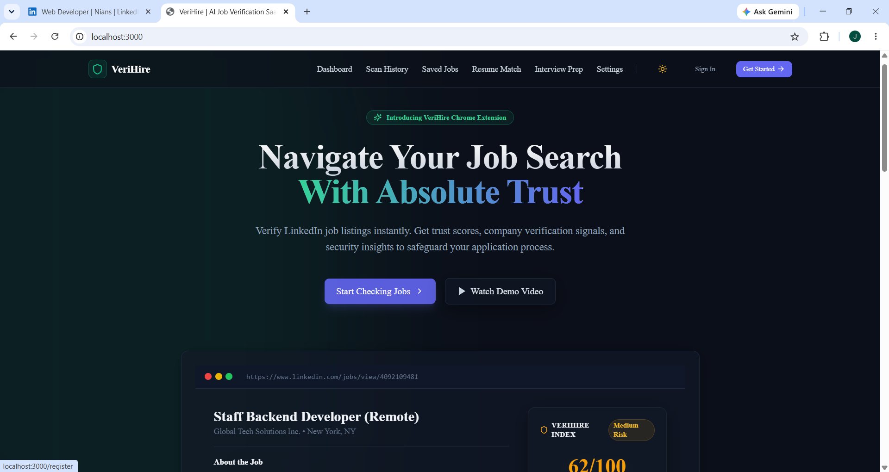

# 🛡️ VeriHire — AI Career Intelligence Platform

> **An AI-powered Chrome Extension and Full Stack SaaS platform that helps job seekers analyze opportunities, evaluate trust signals, optimize resumes, prepare for interviews, and manage their entire job search journey—all from one place.**

<p align="center">


</p>

---

# 🚀 Overview

VeriHire is more than a job verification tool.

It is an **AI Career Intelligence Platform** that combines a Chrome Extension with a Full Stack SaaS dashboard to make job searching smarter, safer, and more efficient.

Instead of copying and pasting job descriptions into an AI chatbot, VeriHire works directly inside supported job portals such as LinkedIn. The extension detects job listings, extracts relevant information, performs intelligent analysis, and seamlessly connects with the SaaS dashboard.

Users can save jobs, manage applications, compare resumes, prepare for interviews, and organize their entire career journey from a single platform.

---


# 📸 Project Showcase

Experience VeriHire through its modern Chrome Extension and Full Stack SaaS dashboard.

---

## 🏠 AI Career Dashboard

A personalized dashboard where users can manage their complete job search journey, including saved jobs, application tracking, analytics, resume intelligence, interview preparation, and AI-powered career tools.

<p align="center">
  
</p>

---

## 🧩 Chrome Extension

VeriHire integrates directly into LinkedIn Jobs with a floating **Analyze Job** button, allowing users to review opportunities without leaving the page.

<p align="center">
  
</p>

---

## 🤖 AI Job Analysis

Clicking the floating VeriHire button opens an intelligent side panel that extracts job information and provides Demo Analysis or Real AI Analysis (when an AI provider is configured).

<p align="center">
  
</p>

---

> 🚀 More screenshots, walkthrough GIFs, and feature demonstrations will be added as VeriHire continues to evolve.


---

# 🎥 Demo

Coming Soon

The demo will showcase:

* Chrome Extension installation
* LinkedIn job detection
* Demo Analysis
* Real AI Analysis
* Resume Matching
* Interview Preparation
* Dashboard workflow

---

# ✨ Key Features

## 🧩 AI Chrome Extension

* Floating "Analyze Job" bubble on supported job portals
* Automatic job information extraction
* Beautiful in-page analysis panel
* Demo Analysis available without an AI API key
* Optional Bring Your Own AI (BYOK)
* Save jobs directly from the browser
* One-click navigation to the SaaS dashboard

---

## 🛡️ AI Job Intelligence

Instead of declaring jobs as "Fake", VeriHire provides explainable insights including:

* Trust Score
* Risk Level
* Suspicious Indicators
* Company Signals
* Description Quality
* Missing Information
* Safety Recommendations
* AI Explanation (when AI provider is configured)

---

## 🏢 Company Intelligence

* Company overview
* Professional presence
* Hiring credibility indicators
* Website verification signals
* General trust signals

---

## 📄 Resume Intelligence

* Resume upload
* ATS compatibility analysis
* Resume-job match score
* Skill gap detection
* Resume improvement suggestions
* AI recommendations

---

## 🎤 AI Interview Preparation

Generate personalized:

* HR Questions
* Technical Questions
* Company-specific Questions
* Coding Challenges
* Suggested Answers
* Interview Roadmap

---

## 🎯 AI Career Coach

Receive AI-powered guidance for:

* Career planning
* Skill recommendations
* Learning roadmap
* Resume improvements
* Job suitability

---

## 📊 Application Tracker

Track every application in one place.

Stages include:

* Saved
* Applied
* Interview
* Assessment
* Offer
* Rejected

---

## 📈 Analytics Dashboard

Monitor your progress with:

* Saved Jobs
* Applications
* Resume Match Scores
* Scan History
* Interview Statistics
* Weekly Activity

---

## 🔐 Secure Authentication

* Clerk Authentication
* Protected Routes
* User Profiles
* Personalized Dashboard
* Cloud Synchronization

Each authenticated user only sees their own saved jobs, scans, applications, analytics, and profile data.

---

# ⚡ Demo Mode & AI Mode

VeriHire supports two analysis modes.

### 🟡 Demo Mode

Works immediately without requiring any AI API key.

Provides a realistic demonstration of the extension using extracted job information.

### ✨ Real AI Mode

Users can connect their own AI provider for personalized analysis.

Supported providers include:

* OpenAI
* Google Gemini
* Anthropic Claude
* Groq
* OpenRouter

---


# 🛠️ Tech Stack

## Frontend

* Next.js
* React
* TypeScript
* Tailwind CSS

## Chrome Extension

* Manifest V3
* Content Scripts
* Background Service Worker
* Message Passing API

## Backend

* Next.js API Routes
* TypeScript

## Database

* PostgreSQL
* Prisma ORM

## Authentication

* Clerk

## AI

* OpenAI (Optional)
* Gemini (Optional)
* OpenRouter
* Groq
* Claude

## Deployment

* Vercel

---

# 📂 Project Structure

```
app/
components/
extension/
hooks/
lib/
prisma/
public/
types/
utils/
```

---

# 🚀 Installation

Clone the repository

```bash
git clone https://github.com/jyotidxt/veriHire.git
```

Install dependencies

```bash
npm install
```

Configure environment variables

```bash
cp .env.example .env
```

Run the web application

```bash
npm run dev
```

Build the Chrome Extension

```bash
cd extension
npm run build
```

---

# 🧩 Install Chrome Extension

1. Build the extension.

2. Open Chrome.

```
chrome://extensions
```

3. Enable **Developer Mode**.

4. Click **Load unpacked**.

5. Select the built extension folder.

6. Pin VeriHire.

7. Open LinkedIn Jobs.

8. Click the floating VeriHire button.

---

# 🔐 Environment Variables

Create a `.env` file based on `.env.example`.

Typical configuration includes:

* Clerk Authentication
* PostgreSQL
* Prisma
* AI Provider Keys (Optional)

---

# 🎯 Project Goals

* Make job searching safer
* Simplify AI-assisted career guidance
* Improve resume quality
* Reduce repetitive workflows
* Centralize job applications
* Build a modern AI-powered career platform

---

# 🛣️ Roadmap

* ✅ Full Stack SaaS
* ✅ Chrome Extension
* ✅ Authentication
* ✅ LinkedIn Integration
* ✅ Job Detection
* ✅ Demo Analysis
* ✅ Resume Intelligence
* ✅ Interview Preparation
* ✅ Application Tracker
* ✅ Analytics Dashboard
* ⏳ Additional Job Platforms
* ⏳ Mobile Application
* ⏳ Team Features

---

# 🔮 Future Enhancements

* Indeed support
* Glassdoor support
* Wellfound support
* AI Salary Estimation
* AI Cover Letter Generation
* Resume Version Management
* Browser Notifications
* Mobile App
* Recruiter Dashboard

---

# 🤝 Contributing

Contributions, feature requests, and bug reports are welcome.

If you'd like to contribute:

1. Fork the repository
2. Create a feature branch
3. Commit your changes
4. Open a Pull Request

---

# 📄 License

MIT License

---

# ⭐ Support

If you found this project useful, consider giving it a ⭐ on GitHub.

---

## 👨‍💻 Author

**Jyoti**

Built as a portfolio project demonstrating:

* Full Stack Development
* Chrome Extension Development
* AI Integration
* Authentication
* Database Design
* Modern SaaS Architecture
* Production-ready UI/UX

---

> **VeriHire demonstrates how AI, browser extensions, and modern web technologies can work together to create a smarter and more efficient job search experience.**
